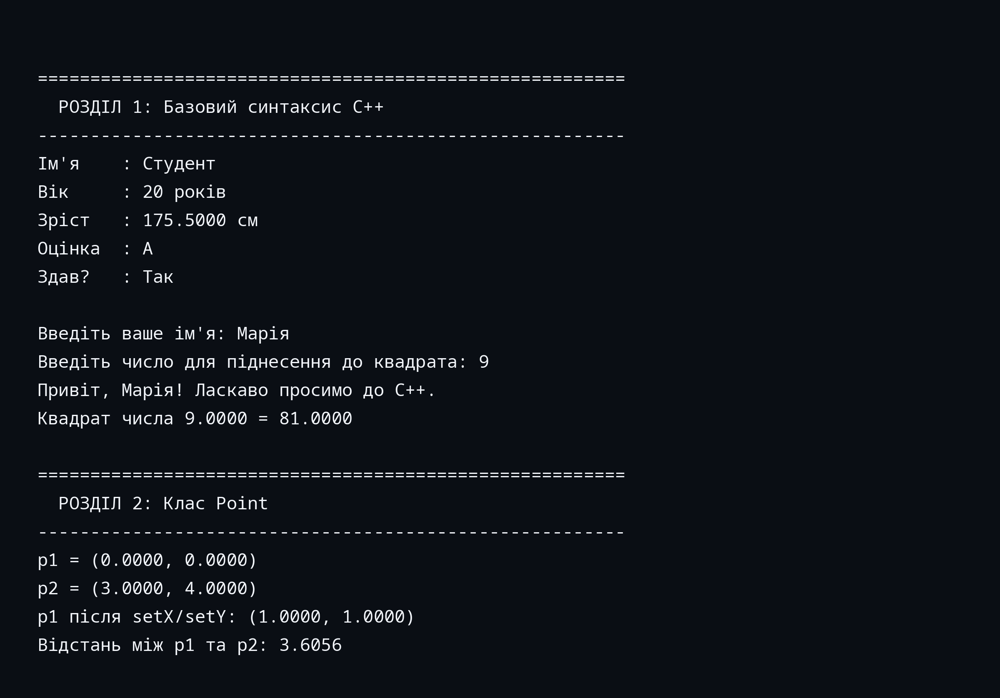
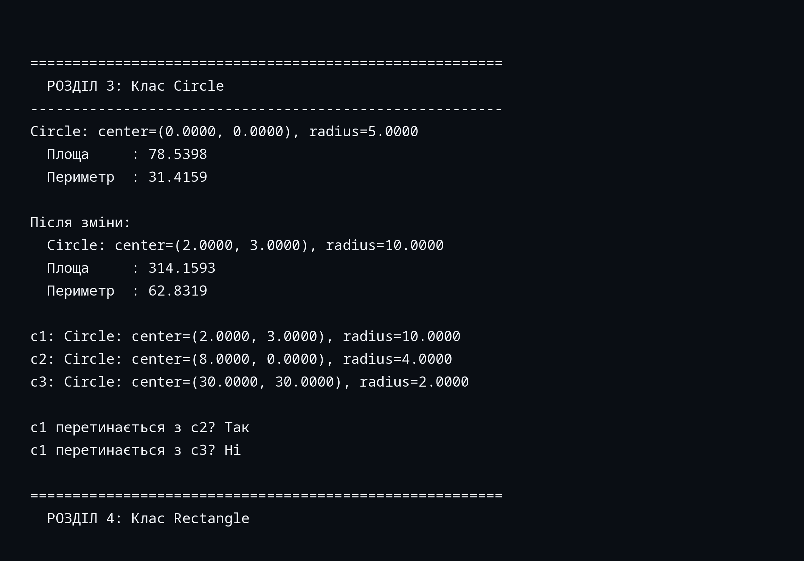
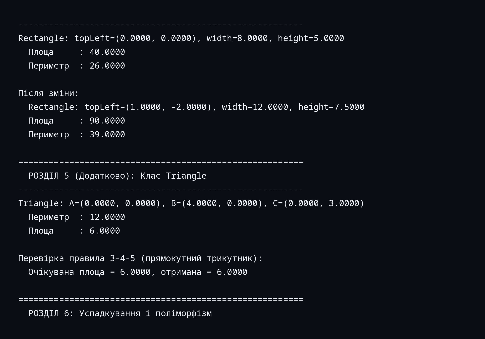
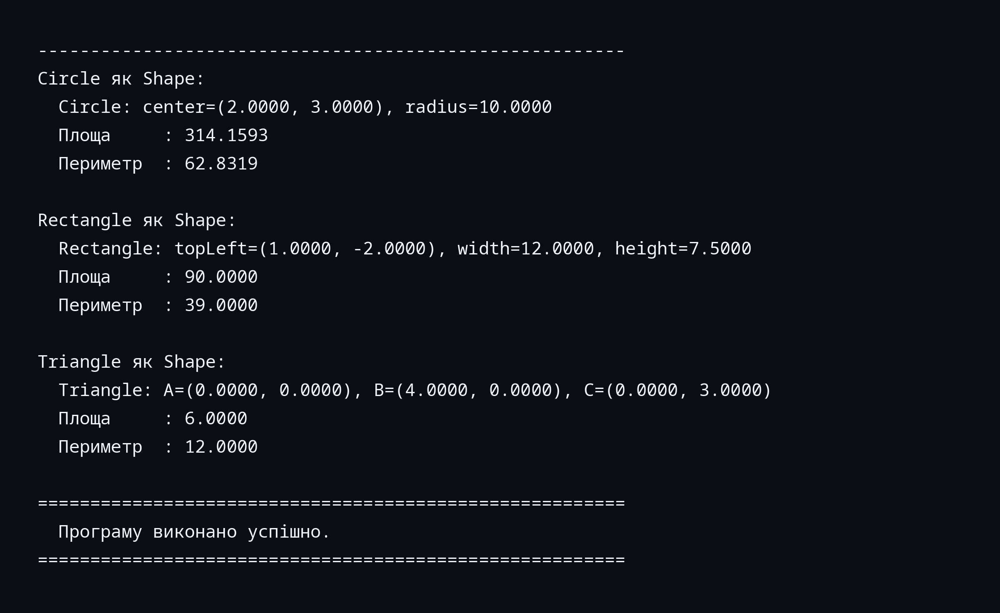

# Лабораторна робота №1
## Тема: Вступ до основ об'єктно-орієнтованого програмування (ООП) та C++

**Мета роботи:**
1. Ознайомитися з базовими принципами ООП (інкапсуляція, успадкування, поліморфізм).
2. Вивчити основні елементи синтаксису C++ (`main()`, змінні, оператори, бібліотеки, простори імен).
3. Навчитися створювати простий клас, оголошувати його поля та методи, створювати об'єкти, отримувати та змінювати їх стан.

---

## 1. Код програми

Файл: [`main.cpp`](./main.cpp)

### 1.1 Структура програми

| Компонент | Опис |
|-----------|------|
| `Shape` | Абстрактний базовий клас (`area()`, `perimeter()`, `print()`) для демонстрації успадкування і поліморфізму |
| `Point` | Клас точки на площині з приватними полями `x`, `y`; гетери/сетери; метод обчислення відстані |
| `Circle` | Дочірній клас від `Shape`: поля `radius`, `center`; методи `area()`, `perimeter()`, `intersects()` |
| `Rectangle` | Дочірній клас від `Shape`: поля `width`, `height`, `topLeft`; методи `area()`, `perimeter()` |
| `Triangle` | Дочірній клас від `Shape`: три вершини (`Point`); площа за формулою Герона, периметр |
| `square()`, `greet()`, `printShapeMetrics()` | Прості функції для демонстрації синтаксису та поліморфного виклику |
| `main()` | Точка входу; демонстрація вводу/виводу, класів і поліморфізму |

### 1.2 Використані бібліотеки

```cpp
#include <iostream>   // cin, cout, endl
#include <cmath>      // sqrt, fabs
#include <string>     // std::string
#include <iomanip>    // setprecision, fixed
#include <vector>     // std::vector
#include <limits>     // std::numeric_limits
```

---

## 2. Виконання програми (скріншот / результат)

Команда компіляції та запуску:
```bash
g++ -std=c++17 -Wall -Wextra -pedantic -o lab1 main.cpp
printf "Марія\n9\n" | ./lab1
```

### Скріншоти виконання






### Фрагмент виводу програми

```
========================================================
  РОЗДІЛ 1: Базовий синтаксис C++
--------------------------------------------------------
Ім'я    : Студент
Вік     : 20 років
Зріст   : 175.5000 см
Оцінка  : A
Здав?   : Так

Введіть ваше ім'я: Введіть число для піднесення до квадрата: Привіт, Марія! Ласкаво просимо до C++.
Квадрат числа 9.0000 = 81.0000

========================================================
  РОЗДІЛ 2: Клас Point
--------------------------------------------------------
p1 = (0.0000, 0.0000)
p2 = (3.0000, 4.0000)
p1 після setX/setY: (1.0000, 1.0000)
Відстань між p1 та p2: 3.6056

========================================================
  РОЗДІЛ 3: Клас Circle
--------------------------------------------------------
Circle: center=(0.0000, 0.0000), radius=5.0000
  Площа     : 78.5398
  Периметр  : 31.4159

Після зміни:
  Circle: center=(2.0000, 3.0000), radius=10.0000
  Площа     : 314.1593
  Периметр  : 62.8319

c1: Circle: center=(2.0000, 3.0000), radius=10.0000
c2: Circle: center=(8.0000, 0.0000), radius=4.0000
c3: Circle: center=(30.0000, 30.0000), radius=2.0000

c1 перетинається з c2? Так
c1 перетинається з c3? Ні

========================================================
  РОЗДІЛ 4: Клас Rectangle
--------------------------------------------------------
Rectangle: topLeft=(0.0000, 0.0000), width=8.0000, height=5.0000
  Площа     : 40.0000
  Периметр  : 26.0000

Після зміни:
  Rectangle: topLeft=(1.0000, -2.0000), width=12.0000, height=7.5000
  Площа     : 90.0000
  Периметр  : 39.0000

========================================================
  РОЗДІЛ 5 (Додатково): Клас Triangle
--------------------------------------------------------
Triangle: A=(0.0000, 0.0000), B=(4.0000, 0.0000), C=(0.0000, 3.0000)
  Периметр  : 12.0000
  Площа     : 6.0000

Перевірка правила 3-4-5 (прямокутний трикутник):
  Очікувана площа = 6.0000, отримана = 6.0000

========================================================
  РОЗДІЛ 6: Успадкування і поліморфізм
--------------------------------------------------------
Circle як Shape:
  Circle: center=(2.0000, 3.0000), radius=10.0000
  Площа     : 314.1593
  Периметр  : 62.8319

Rectangle як Shape:
  Rectangle: topLeft=(1.0000, -2.0000), width=12.0000, height=7.5000
  Площа     : 90.0000
  Периметр  : 39.0000

Triangle як Shape:
  Triangle: A=(0.0000, 0.0000), B=(4.0000, 0.0000), C=(0.0000, 3.0000)
  Площа     : 6.0000
  Периметр  : 12.0000

========================================================
  Програму виконано успішно.
========================================================
```

> **Примітка:** Усі результати перевірені вручну (π ≈ 3.14159265):
> - `Circle(r=5)` → S = π·25 ≈ **78.5398** ✓, P = 2π·5 ≈ **31.4159** ✓
> - `Circle(r=10)` → S = π·100 ≈ **314.1593** ✓
> - `Rectangle(8×5)` → S = **40.0** ✓, P = **26.0** ✓
> - `Triangle(3-4-5)` → S = **6.0** ✓ (єгипетський трикутник)

---

## 3. Відповіді на контрольні питання

### 3.1 Яка різниця між компіляцією та інтерпретацією?

| Характеристика | Компіляція | Інтерпретація |
|----------------|-----------|---------------|
| Час перетворення | Перед виконанням (одноразово) | Під час виконання (рядок за рядком) |
| Результат | Бінарний машинний код (`.exe`, `.out`) | Безпосереднє виконання через інтерпретатор |
| Швидкість виконання | Висока (код вже в машинному форматі) | Нижча (зупинки на трансляцію кожного рядка) |
| Приклади мов | C, C++, Rust, Go | Python, JavaScript (без JIT), Ruby |
| Портабельність | Потребує перекомпіляції під кожну ОС | Код переносимий, але потрібен інтерпретатор |

**Компіляція в C++:** вихідний код (`main.cpp`) → препроцесор → компілятор → об'єктний файл (`.o`) → компоновщик (linker) → виконуваний файл (`lab1`).

**Інтерпретація:** інтерпретатор читає вихідний код рядок за рядком і одразу виконує кожну інструкцію.

**Висновок:** C++ є компільованою мовою, тому програми на C++ зазвичай значно швидші за інтерпретовані аналоги.

---

### 3.2 Що таке змінна і які її основні типи в C++?

**Змінна** — іменована комірка пам'яті певного типу, що зберігає значення, яке може змінюватися під час виконання програми.

#### Основні типи даних у C++

| Категорія | Тип | Розмір | Діапазон / Опис |
|-----------|-----|--------|-----------------|
| **Цілі числа** | `int` | 4 байти | -2 147 483 648 … 2 147 483 647 |
| | `short` | 2 байти | -32 768 … 32 767 |
| | `long` | 4–8 байт | залежить від платформи |
| | `long long` | 8 байт | ±9.2 × 10¹⁸ |
| | `unsigned int` | 4 байти | 0 … 4 294 967 295 |
| **Дійсні числа** | `float` | 4 байти | ≈7 значущих цифр |
| | `double` | 8 байт | ≈15 значущих цифр |
| | `long double` | 10–16 байт | ≈18–19 значущих цифр |
| **Символ** | `char` | 1 байт | один символ ASCII (-128 … 127) |
| **Логічний** | `bool` | 1 байт | `true` або `false` |
| **Рядок** | `std::string` | динамічний | послідовність символів (STL) |
| **Порожній** | `void` | — | відсутність типу (для функцій) |

Приклад оголошення:
```cpp
int    age    = 20;          // ціле число
double height = 175.5;       // дійсне число подвійної точності
char   grade  = 'A';         // символ
bool   passed = true;        // логічне значення
std::string name = "Іван";   // рядок
```

---

## 4. Відповіді на питання для самоперевірки

### 4.1 Що таке ООП і які його основні принципи?

**ООП (Об'єктно-орієнтоване програмування)** — парадигма програмування, що будує програму як взаємодію об'єктів.

**Три основних принципи:**

1. **Інкапсуляція** — приховування внутрішнього стану об'єкта і надання доступу до нього лише через визначений інтерфейс (публічні методи). У C++ реалізується через специфікатори `private` / `public`.

2. **Успадкування** — можливість створення дочірнього класу, що успадковує поля і методи батьківського, розширюючи або перевизначаючи їх. Ключове слово `: public BaseClass`.

3. **Поліморфізм** — здатність різних об'єктів реагувати на одне й те саме повідомлення (виклик методу) по-різному. У C++ реалізується через `virtual`-функції та перевантаження операторів.

---

### 4.2 Поясніть сенс інкапсуляції. Чому поля класу рекомендується робити приватними?

**Інкапсуляція** — поєднання даних і методів у одному класі із захистом внутрішніх даних від прямого зовнішнього доступу.

**Переваги приватних полів:**
- **Захист від некоректних значень.** Наприклад, у `Circle::setRadius()` перевіряється, що радіус ≥ 0.
- **Контроль доступу.** Дозвіл лише на читання (`getX()`) або лише на запис за потреби.
- **Гнучкість реалізації.** Внутрішнє представлення можна змінювати без зміни інтерфейсу.
- **Спрощення налагодження.** Всі зміни стану об'єкта проходять через задокументовані методи.

---

### 4.3 Чим відрізняються `public`, `private`, і `protected` у C++?

| Специфікатор | Доступ у класі | Доступ у дочірньому класі | Доступ ззовні |
|---|---|---|---|
| `public`    | ✅ Так | ✅ Так | ✅ Так |
| `protected` | ✅ Так | ✅ Так | ❌ Ні  |
| `private`   | ✅ Так | ❌ Ні  | ❌ Ні  |

---

### 4.4 Де оголошуються змінні-члени і методи у класі?

- **Поля (змінні-члени)** — зазвичай у секції `private` або `protected`.
- **Методи (функції-члени)** — у секції `public` (інтерфейс класу) або `private` (внутрішні допоміжні методи).
- Реалізація методів — усередині тіла класу або за межами класу через `ClassName::methodName()`.

---

### 4.5 Яка різниця між `struct` та `class` у C++?

| Ознака | `struct` | `class` |
|--------|---------|---------|
| Доступ за замовчуванням | `public` | `private` |
| Успадкування за замовчуванням | `public` | `private` |
| Використання | Прості агрегати даних (C-сумісність) | Повноцінні об'єкти з інкапсуляцією |

В іншому — **функціонально ідентичні** в C++.

---

### 4.6 Що таке конструктор класу і які він має завдання?

**Конструктор** — спеціальний метод, що викликається автоматично при створенні об'єкта.

**Завдання:**
1. Ініціалізація полів об'єкта початковими значеннями.
2. Виділення ресурсів (пам'ять, файли тощо).
3. Перевірка коректності переданих аргументів.

**Особливості:** ім'я збігається з іменем класу; не має типу повернення; може бути перевантажений.

```cpp
Point()                    // конструктор за замовчуванням
Point(double x, double y)  // конструктор з параметрами
```

---

### 4.7 Як створюються об'єкти і як викликаються методи класу?

```cpp
// Створення об'єктів
Point p1;                 // конструктор за замовчуванням
Point p2(3.0, 4.0);       // конструктор з параметрами
Circle c(5.0, 0.0, 0.0);  // ініціалізація через конструктор

// Виклик методів через оператор "крапка"
p2.print();               // метод без повернення
double d = p1.distanceTo(p2);  // метод з поверненням значення
c.setRadius(7.0);         // сетер
```

---

### 4.8 Особливості використання ключового слова `this`

`this` — неявний вказівник на **поточний об'єкт**, що доступний усередині всіх нестатичних методів класу.

**Де використовується:**
- Коли ім'я параметра збігається з ім'ям поля: `this->x = x;`
- При поверненні поточного об'єкта: `return *this;` (для ланцюжків викликів)
- При передачі об'єкта в іншу функцію: `someFunc(this);`

```cpp
void setX(double x) {
    this->x = x;  // this->x — поле класу, x — параметр функції
}
```

---

## 5. Висновок

У ході виконання лабораторної роботи:

1. Вивчено базовий синтаксис C++: оголошення змінних різних типів (`int`, `double`, `char`, `bool`, `std::string`), оператори вводу/виводу (`std::cin`, `std::cout`), оголошення та виклик функцій.

2. Реалізовано п'ять класів (`Shape`, `Point`, `Circle`, `Rectangle`, `Triangle`): інкапсуляція продемонстрована через `private`-поля та гетери/сетери, успадкування — через `Circle/Rectangle/Triangle : public Shape`.

3. Продемонстровано роботу **конструкторів** (за замовчуванням та з параметрами), а також **перевантаження конструкторів**.

4. Реалізовано геометричні обчислення: площа та периметр кола, прямокутника і трикутника (формула Герона), відстань між точками, перевірка перетину кіл.

5. Продемонстровано **поліморфізм**: виклик `area()/perimeter()/print()` через вказівник на базовий клас `Shape*` виконує перевизначені методи дочірніх класів.

6. Програма успішно скомпільована командою `g++ -std=c++17 -Wall -Wextra -pedantic -o lab1 main.cpp` і виконана без помилок та попереджень.
